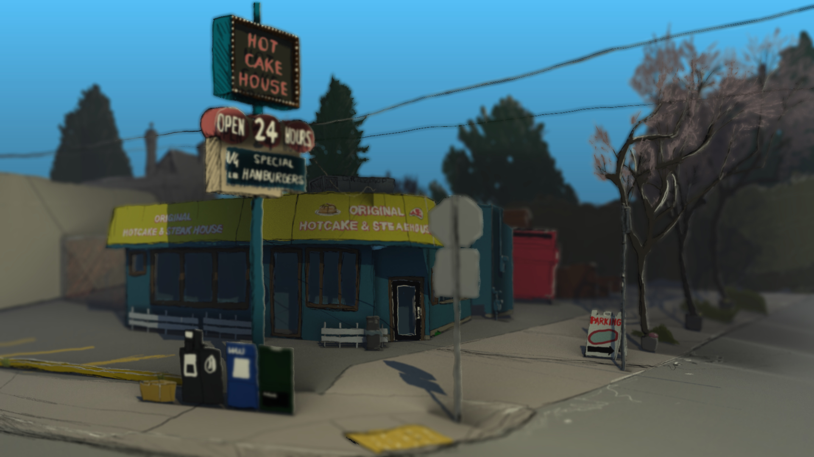
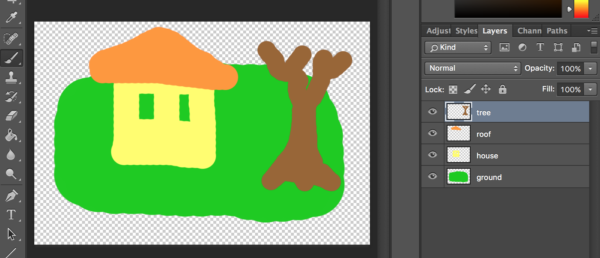
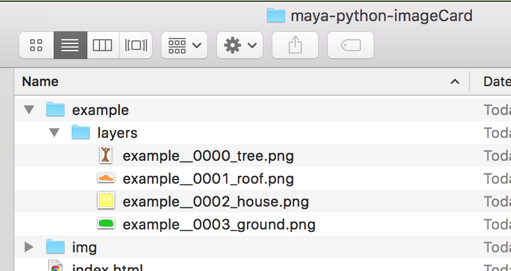

# maya-python-imageCard
This is a project describing a workflow to create 3D scenes from 2D images.


### Step 1. Photoshop
> When deciding how to paint the individual layers here, try and think of breaking down the objects in the image into pieces you might cut out of paper to build a 3D object.  I like to think of building a house out of playing cards.  The cartoon South Park is the best example of what we're going for here.

- Start by creating a new image, 900 x 600 pixels (just to keep it simple, I'm using the "Photo" preset).  Make sure **Color Mode** is **16-bit** and **Background Contents** is set to **Transparent**.
- Create different layers to represent a ground plane and a couple of objects.

- File -> Export -> Layers to files.
- Set Type to PNG-24.
- Make sure **Trim Layers** and **Transparency** are checked **on**.


### Step 2. Maya - Python Script
- Open your ```~/Documents/maya/scripts/``` folder from a terminal window.
- Type ``` git clone https://github.com/zklinger2000/maya-python-imageCard.git ``` to download the scripts.

### Step 2. Maya - imageCard Importing
- Open up Maya to a blank scene.
- Load the python script [coffeeSetup.py][pySetup].
- Update the folder variable to point to your folder.

### Step 3. Maya - Scene Building
- Move each **imageCard** (2D plane) into the desired position.
- Be careful to avoid any tightly overlapping or intersecting planes whenever possible.  Although this can also produce interesting results...

### Step 4. Maya - Lighting
- Only add lights to the master/beauty render layer!
- Use whatever lights you desire, but simple spot, point and directional lights save tons of rendering time.

### Step 5. Maya - Rendering
- **Much more detail is required here**
- Use Software rendering for Z-Depth pass

### Step 6. Fusion - Compositing
- **Tons of detail here...**

   [pySetup]: <https://bitbucket.org/zklinger2000/gravmodtools/src/04fc15eee47327e9dfbd9c0c61da19d29a415315/setupCoffee.py>
