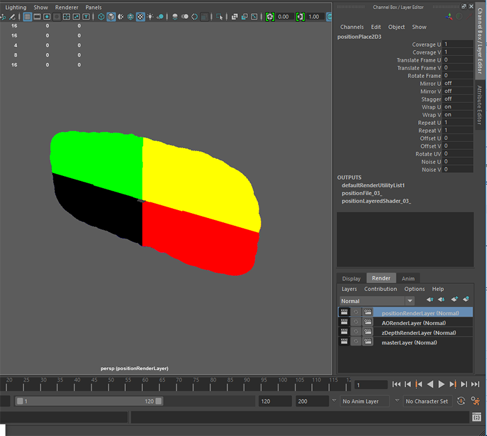
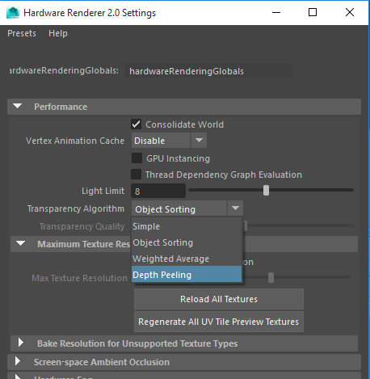
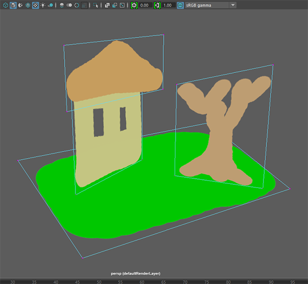
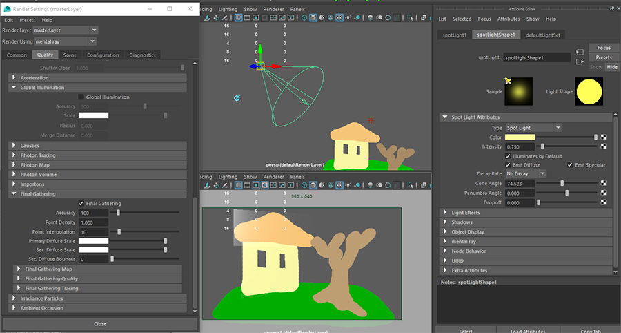
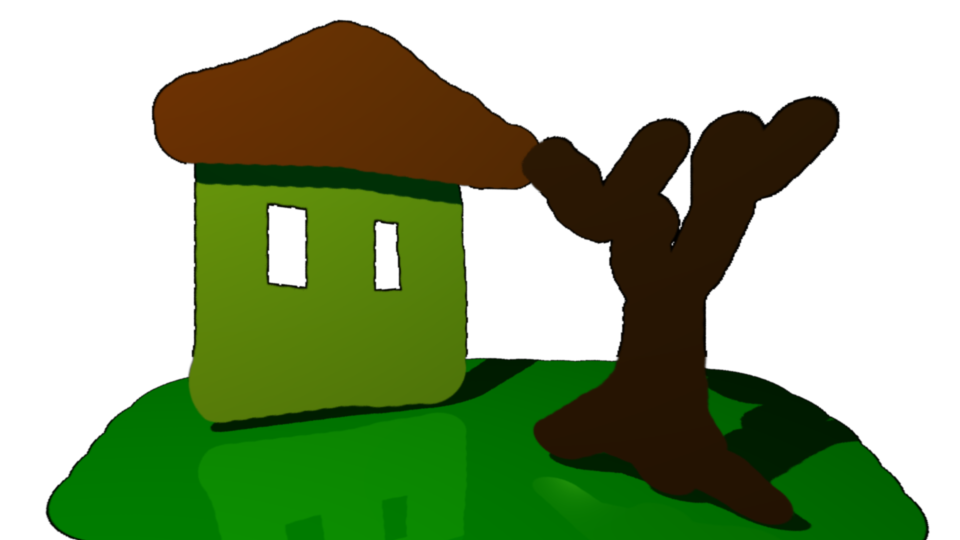
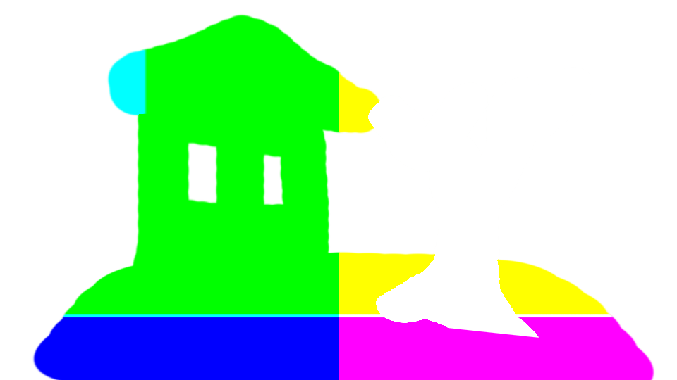
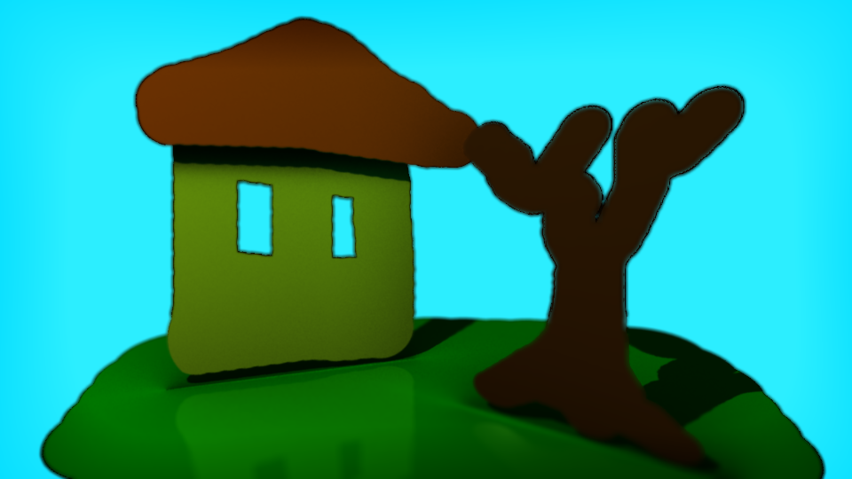
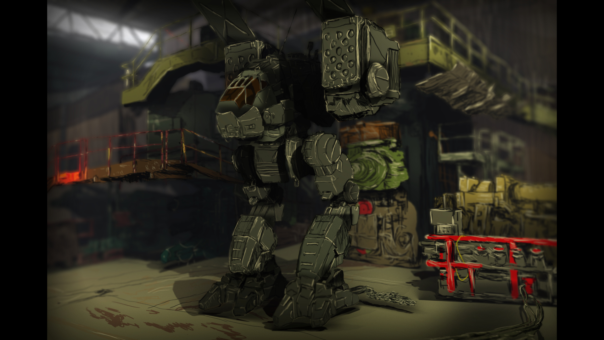

# maya-python-imageCard
This is a project describing a workflow to create 3D scenes from 2D images.


### Step 1. Photoshop
> When deciding how to paint the individual layers here, try and think of breaking down the objects in the image into pieces you might cut out of paper to build a 3D object.  I like to think of building a house out of playing cards.  The cartoon South Park is the best example of what we're going for here.

- Start by creating a new image, 900 x 600 pixels (just to keep it simple, I'm using the "Photo" preset).  Make sure **Color Mode** is **16-bit** and **Background Contents** is set to **Transparent**.
- Create different layers to represent a ground plane and a couple of objects.

- File -> Export -> Layers to files.
- Set Type to PNG-24.
- Make sure **Trim Layers** and **Transparency** are checked **on**.


### Step 2. Maya - Python Script
- Open your ```~/Documents/maya/scripts/``` folder from a terminal window.
- Type ``` git clone https://github.com/zklinger2000/maya-python-imageCard.git ``` to download the scripts.

### Step 3. Maya - imageCard Importing
- Open up Maya to a blank scene.
- Load the python script [imageCardsImport.py][pySetup] into the script editor.
- Make sure all the folder paths in [gravModTools.py][gMT] and [imageCardsImport.py][pySetup] are correctly assigned to your local folders.
-  Highlight the entire script in the script editor and hit ``` Enter ```. (There are multiple ways to run scripts in Maya other than this one)
-  Depending on how many images you have in the folder and how big they are, this may take a little time.
-  Once the script has completed running, if there are no errors (usually having to do with improper folder name escaping, etc.), you will see a big black, yellow, red and green blob filling up your viewport.
-  Zoom out and click on the **masterLayer** in the Render layer tab to see the imageCards.


### Step 4. Maya - Scene Building
- TIP: In the viewport panel, go to Renderer -> Viewport 2.0 -> [] and change **Transparency Algorithm** to **Depth Peeling**.

- Move each **imageCard** (2D plane) into the desired position.

- Be careful to avoid any tightly overlapping or intersecting planes whenever possible.  Although this can also produce interesting results...

### Step 5. Maya - Lighting
- Only add lights to the master/beauty render layer!
- Use whatever lights you desire, but simple spot, point and directional lights save tons of rendering time.
- Make sure you turn "default light" off in the Render Globals.
- Use mentalray as your renderer for each pass except Z-Depth.
- Final Gather is optional.


### Step 6. Maya - Rendering
- **Much more detail is required here**
- Add a simple camera to your scene.
- Turn off all the other render layers and render out the color/beauty pass.

**Beauty Pass**


**Ambient Occlusion Pass**


**Z-Depth Pass**


**Position Pass**


- Use Software rendering for Z-Depth pass

### Step 7. Fusion - Compositing
- **Tons of detail here...**

**Final Comp**


### Final Thoughts
> There are still some issues with premultiplying around the edges, but that's due to the images being drawn in Photoshop without proper alpha channels.  I've found that just simply adding a lot of detail and drawing with a thick outline, comic book style, they get hidden mostly.  Otherwise, it's been an interesting exercise.  Thanks for reading!  I'd love to see how people can make this  better.




   [pySetup]: <https://github.com/zklinger2000/maya-python-imageCard/blob/master/scripts/imageCardsImport.py>
   [gMT]: <https://github.com/zklinger2000/maya-python-imageCard/blob/master/scripts/gravModTools.py>
